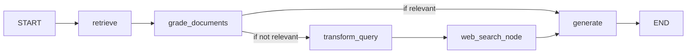

# Corrective RAG (CRAG) Demo

This repository contains a demonstration of **Corrective Retrieval-Augmented Generation (CRAG)** implemented with LangGraph. CRAG enhances traditional RAG by evaluating and refining retrieved documents before feeding them to an LLM, reducing hallucinations and improving accuracy.

## 🚀 Features

* **Vector Store Ingestion**: Load and chunk documents from web sources into a Chroma vector database.
* **Basic RAG Chain**: Retrieve relevant chunks and generate answers with GPT-4o-mini.
* **Retrieval Evaluator**: Classify retrieved documents as relevant or not via a structured LLM prompt.
* **Question Rewriter**: Refine user queries for better relevance and web search performance.
* **Conditional Web Search**: Automatically perform a Tavily-powered web search when base documents are insufficient.
* **LangGraph Workflow**: Orchestrate the full CRAG pipeline as a directed graph with retrieval, evaluation, transformation, search, and generation nodes.

## 📦 Prerequisites

* Python 3.9+
* [pip](https://pip.pypa.io)
* An OpenAI API key
* A Tavily API key

## ⚙️ Installation

1. Clone the repository:

   ```bash
   git clone https://github.com/seanpoyner/crag-langgraph-demo.git
   cd crag-langgraph-demo
   ```
2. Create and activate a virtual environment:

   ```bash
   python -m venv .venv
   source .venv/bin/activate  # on Windows: .\.venv\Scripts\activate
   ```
3. Install dependencies:

   ```bash
   pip install --upgrade pip
   pip install -r requirements.txt
   ```
4. Copy `.env.example` to `.env` and populate your API keys:

   ```bash
   cp example.env .env
   # then edit .env to add your OPENAI_API_KEY and TAVILY_API_KEY
   ```

## 💡 Usage

### 1. Ingestion & Indexing

```python
from langchain_community.document_loaders import WebBaseLoader
from langchain.text_splitter import RecursiveCharacterTextSplitter
from langchain_community.vectorstores import Chroma
from langchain.embeddings import OpenAIEmbeddings

# Load and split documents
docs = [WebBaseLoader(url).load() for url in urls]
docs_list = [d for sub in docs for d in sub]
splitter = RecursiveCharacterTextSplitter.from_tiktoken_encoder(chunk_size=250, chunk_overlap=0)
splits = splitter.split_documents(docs_list)

# Build vector store
vectorstore = Chroma.from_documents(splits, collection_name="rag-chroma", embedding=OpenAIEmbeddings())
retriever = vectorstore.as_retriever()
```

### 2. Basic RAG Chain

```python
from langchain import hub
from langchain.chat_models import ChatOpenAI
from langchain_core.output_parsers import StrOutputParser

rag_prompt = hub.pull("rlm/rag-prompt")
rag_llm = ChatOpenAI(model_name="gpt-4o-mini", temperature=0)
rag_chain = rag_prompt | rag_llm | StrOutputParser()

answer = rag_chain.invoke({"context": docs_list, "question": "What is the bagel method?"})
print(answer)
```

### 3. CRAG Pipeline

Run the full corrective RAG workflow via LangGraph:

```python
from langgraph.graph import StateGraph, START, END
# ... import and define retrieve, evaluate_documents, transform_query, web_search, generate, decide_to_generate

workflow = StateGraph(GraphState)
# add nodes and edges as in the notebook...
app = workflow.compile()

# Execute
gen = None
for state in app.stream({"question": "What's the bagel method?"}):
    gen = state.get("generation")
print("CRAG Answer:", gen)
```

## 🏗️ Architecture Overview



## 📖 How It Works

1. **Retrieval**: Get top-k chunks from the Chroma vector store.
2. **Evaluation**: Use GPT-4o-mini to label each chunk ‘yes’/‘no’ for relevance.
3. **Decision**: If fewer than 70% of chunks are relevant, rewrite query and fetch web results.
4. **Generation**: Produce a concise answer using only the vetted content.

## 🧑‍🤝‍🧑 Contributing

Contributions are welcome! Please open issues or pull requests for bug fixes, improvements, or new features.

## 📄 License

This project is licensed under the [MIT License](LICENSE).

---

*Demo created by Sean Poyner.*
